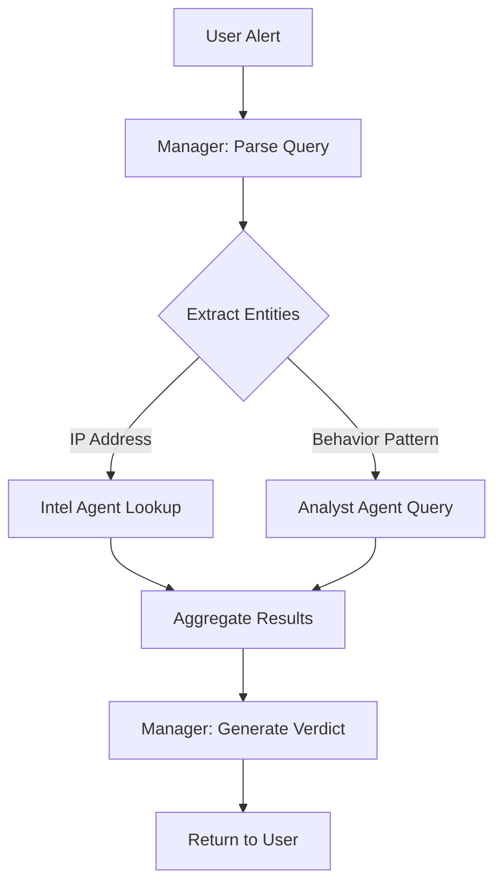

# Day 3: Manager Agent (Orchestrator)

## 🎯 Objective
Build the "brain" of the swarm - an orchestrator agent that takes high-level security alerts, breaks them into tasks, and coordinates the Analyst and Intel agents.

---

## 🧠 What is a Manager Agent?

**Without Manager Agent:**
- User must manually decide: "Should I check IP reputation? Should I analyze logs?"
- User must call each agent separately and combine results
- No unified investigation workflow

**With Manager Agent:**
- User: "Investigate suspicious activity from 89.248.172.16"
- Manager: *Thinks* "I need to: 1) Check IP reputation, 2) Analyze traffic patterns, 3) Correlate findings"
- Manager: *Delegates* → Intel Agent + Analyst Agent
- Manager: *Synthesizes* → "This IP is known malicious (TOR exit node) with 1,667 brute force attempts. Verdict: CRITICAL threat"

**Why this matters:**
- **Single entry point**: One API call handles entire investigation
- **Intelligent routing**: Manager decides which agents to invoke
- **Context preservation**: Manager maintains investigation state
- **Human-readable verdicts**: Converts technical data into actionable recommendations

---

## 🏗️ Architecture Overview

```
User Alert: "Suspicious activity from 89.248.172.16"
         ↓
    Manager Agent
         ↓
   [Task Decomposition]
    1. Check IP reputation → Intel Agent
    2. Analyze traffic pattern → Analyst Agent
    3. Check for policy violations → Analyst Agent
         ↓
   [Execute Tasks in Parallel]
         ↓
   [Aggregate Results]
         ↓
   [Generate Final Verdict]
    - Severity: CRITICAL
    - Reasoning: Known malicious IP + 1667 brute force attempts
    - Recommended Action: Block IP, reset affected accounts
```

### Key Components We'll Build:

1. **`src/agents/intel_agent.py`** - IP reputation & threat intelligence (NEW)
2. **`src/agents/manager_agent.py`** - Orchestration & task planning
3. **`src/models/manager_models.py`** - Investigation schemas
4. **`src/services/investigation_service.py`** - Workflow coordinator
5. **`src/routers/investigation_router.py`** - Main investigation endpoint

---

## 🕵️ First: Build the Intel Agent

Before building the Manager, we need the Intel Agent to provide threat intelligence.

### Intel Agent Capabilities:

1. **IP Reputation Lookup**
   - Check if IP is in known malicious databases
   - Identify TOR exit nodes, VPN services, cloud providers
   - Return reputation score (0-100, higher = more suspicious)

2. **Threat Context**
   - Historical attack patterns from this IP
   - Geolocation data
   - Associated malware families

### Mock Threat Intelligence Database

For Day 3, we'll use a **hardcoded database**. In production, this would query:
- VirusTotal API
- AbuseIPDB
- Shodan
- IBM X-Force

```python
THREAT_INTELLIGENCE_DB = {
    "89.248.172.16": {
        "reputation": "malicious",
        "category": "brute_force_attacker",
        "threat_score": 95,
        "last_seen": "2026-02-03",
        "notes": "Known SSH/RDP brute force scanner"
    },
    "185.220.101.17": {
        "reputation": "malicious", 
        "category": "tor_exit_node",
        "threat_score": 85,
        "notes": "TOR network exit node, used for anonymization"
    },
    "8.8.8.8": {
        "reputation": "benign",
        "category": "dns_server",
        "threat_score": 0,
        "notes": "Google Public DNS"
    }
}
```

---

## 🎭 Manager Agent Decision Logic

The Manager uses a **planning loop**:

### Phase 1: Task Decomposition
User query → List of sub-tasks

**Example:**
```
Input: "Investigate suspicious login attempts from 89.248.172.16"

Manager Output:
1. [Intel Agent] Check IP reputation for 89.248.172.16
2. [Analyst Agent] Count failed login attempts from this IP
3. [Analyst Agent] Check if any logins succeeded
4. [Analyst Agent] List all targeted usernames
```

### Phase 2: Execution
- Call Intel Agent (async)
- Call Analyst Agent 3x (async, parallel)
- Aggregate results

### Phase 3: Synthesis
Combine all findings into a **ThreatVerdict**:

```python
class ThreatVerdict(BaseModel):
    severity: Literal["critical", "high", "medium", "low", "info"]
    confidence: float  # 0.0 to 1.0
    threat_summary: str
    evidence: List[str]
    recommended_actions: List[str]
    affected_assets: List[str]
```

---

## 🔥 The "ReAct" Pattern (Reasoning + Acting)

The Manager Agent uses the **ReAct framework**:

```
Thought: I need to understand if this IP is known malicious
Action: intel_agent.lookup_ip("89.248.172.16")
Observation: IP is a TOR exit node with threat score 85

Thought: Now I need to see what this IP actually did
Action: analyst_agent.query("Count requests from 89.248.172.16")
Observation: 1,667 login attempts, 0 successful

Thought: I have enough evidence to determine severity
Final Answer: CRITICAL - Known malicious IP attempting credential stuffing
```

This is implemented as a **loop** in the Manager Agent.

---

## 📊 Investigation Workflow



---

## 🛠️ Implementation Steps

### Step 1: Build Intel Agent Models
**File:** `src/models/intel_models.py`

```python
class IPReputationRequest(BaseModel):
    ip_address: str

class IPReputationResponse(BaseModel):
    ip_address: str
    reputation: Literal["malicious", "suspicious", "benign", "unknown"]
    threat_score: int  # 0-100
    category: str
    details: str
```

---

### Step 2: Build Intel Agent
**File:** `src/agents/intel_agent.py`

Mock threat intelligence lookups (we'll integrate real APIs later).

---

### Step 3: Build Manager Models
**File:** `src/models/manager_models.py`

```python
class InvestigationRequest(BaseModel):
    alert: str  # "Suspicious activity from 89.248.172.16"
    priority: Literal["critical", "high", "medium", "low"] = "medium"

class AgentTask(BaseModel):
    agent: Literal["intel", "analyst"]
    action: str
    params: dict

class ThreatVerdict(BaseModel):
    severity: Literal["critical", "high", "medium", "low", "info"]
    confidence: float
    threat_summary: str
    evidence: List[str]
    recommended_actions: List[str]
    affected_assets: List[str]
    investigation_duration_ms: float

class InvestigationResponse(BaseModel):
    alert: str
    verdict: ThreatVerdict
    tasks_executed: List[AgentTask]
    raw_agent_outputs: dict
```

---

### Step 4: Build Manager Agent
**File:** `src/agents/manager_agent.py`

**Key Methods:**
1. `plan_investigation()` - Decompose alert into tasks
2. `execute_tasks()` - Call Intel/Analyst agents
3. `synthesize_verdict()` - Generate final threat verdict

**Prompt Strategy:**
```
You are a SOC Manager coordinating a security investigation.

Available Agents:
1. Intel Agent: IP reputation, threat intelligence
2. Analyst Agent: Query firewall logs using Python/Pandas

Given a security alert, create a plan:
- Which agents to call
- What questions to ask
- In what order

Return JSON:
{
  "tasks": [
    {"agent": "intel", "action": "lookup_ip", "params": {"ip": "..."}},
    {"agent": "analyst", "action": "query_logs", "params": {"query": "..."}}
  ]
}
```

---

### Step 5: Build Investigation Service
**File:** `src/services/investigation_service.py`

Orchestrates the multi-agent workflow:
1. Receive alert
2. Manager plans investigation
3. Execute tasks (parallel where possible)
4. Manager synthesizes verdict
5. Return comprehensive report

---

### Step 6: Build Investigation Router
**File:** `src/routers/investigation_router.py`

Main endpoint: `POST /api/investigate`

---

### Step 7: Update function_app.py

Add the new investigation endpoint.

---

## 🧪 Test Scenarios

### Scenario 1: Known Malicious IP
```json
{
  "alert": "Suspicious login attempts from 89.248.172.16"
}
```

**Expected:**
- Intel Agent: "Malicious, known brute force scanner"
- Analyst Agent: "1,667 failed login attempts"
- Verdict: CRITICAL

---

### Scenario 2: Benign IP with High Traffic
```json
{
  "alert": "High request volume from 8.8.8.8"
}
```

**Expected:**
- Intel Agent: "Benign, Google DNS"
- Analyst Agent: "200 requests (normal)"
- Verdict: INFO

---

### Scenario 3: Unknown IP with Port Scanning
```json
{
  "alert": "Investigate port scanning from 198.50.201.145"
}
```

**Expected:**
- Intel Agent: "Unknown, no historical data"
- Analyst Agent: "Scanned ports 20-99 sequentially"
- Verdict: HIGH (behavior-based detection)

---

## 📈 Success Criteria

By end of Day 3, you should be able to:

✅ Send a high-level alert to `/api/investigate`  
✅ Manager automatically plans which agents to call  
✅ Intel Agent provides IP reputation  
✅ Analyst Agent queries logs based on Manager's questions  
✅ Receive a unified threat verdict with evidence  
✅ See which tasks were executed (observability)

---

## 🎓 Interview Talking Points

**Q: Why build a Manager Agent instead of calling agents directly?**

**A:** "The Manager Agent implements the 'ReAct' pattern - Reasoning + Acting. It:
1. **Reduces cognitive load** - Users don't need to know which agent to call
2. **Enables complex workflows** - Manager can call multiple agents and correlate results
3. **Maintains context** - Manager remembers investigation state across agent calls
4. **Implements business logic** - Manager enforces SOC procedures (e.g., always check IP reputation first)
5. **Enables self-correction** - If Analyst query fails, Manager can rephrase and retry"

**Q: How do you prevent infinite loops in the Manager's planning?**

**A:** "I implement three safeguards:
1. **Max iteration limit** - Manager can execute max 10 tasks per investigation
2. **Task deduplication** - Track executed tasks, prevent calling same task twice
3. **Explicit termination** - Manager must explicitly return 'investigation_complete' signal
This is similar to how LangChain's AgentExecutor works."

**Q: How would you scale this for 1000 simultaneous investigations?**

**A:** "I'd implement:
1. **Task Queue** - Use Azure Service Bus to queue agent tasks
2. **Async execution** - All agent calls are already async (Python asyncio)
3. **Result caching** - Cache IP reputation lookups (Redis)
4. **Horizontal scaling** - Azure Functions auto-scales to 200 instances
5. **Streaming responses** - Use Server-Sent Events to stream investigation progress"

---

## 🚀 Day 4 Preview

Tomorrow we'll add **State Management** with Azure CosmosDB:
- Persist investigation history
- Resume interrupted investigations
- Track agent performance metrics
- Enable investigation replay for post-incident analysis

---

## 📚 Key Concepts Learned

1. **Orchestration Pattern**: Manager delegates to specialized agents
2. **ReAct Framework**: Reasoning (planning) + Acting (execution) loop
3. **Task Decomposition**: Break complex alerts into discrete agent calls
4. **Multi-Agent Coordination**: Parallel execution, result aggregation
5. **Verdict Synthesis**: Convert raw data into actionable intelligence

---

**Estimated Time:** 4-5 hours  
**Lines of Code:** ~600 lines  
**New Dependencies:** None (uses existing OpenAI client)

Let's build the orchestrator! 🎯
